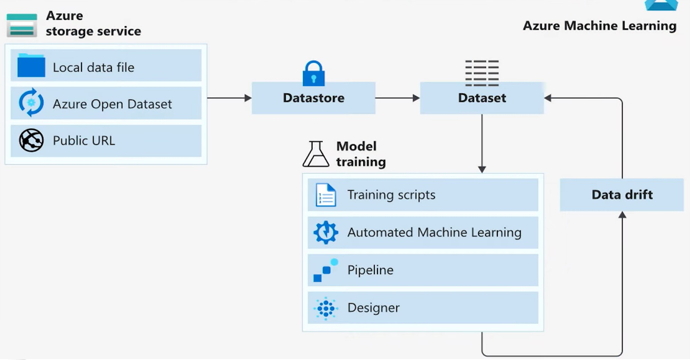

# Model Training

In this lesson, the goal was to give a high-level introduction to the field of machine learning, including the broader context in which this branch of computer science exists.
It was a shorter lesson, and with lots of examples. It also had the first hands on the lab, where we could interact with the azure environment

## Main topics:

The essential data preparation and management tasks involved in machine learning:

- Data importing and transformation
- The use of datastores and datasets
- Versioning
- Feature engineering
- Monitoring for data drift

About model training:

- The core model training process
- Two of the fundamental machine learning models: Classifier and regressor
- The model evaluation process and relevant metrics

How to get better results by using multiple trained models:

- Ensemble learning
- automated machine learning. 

## Notes:

From these topics, these were the main notes I took:

****Prevent Overfitting**** 
- k-fold cross-validation: it split the initial training data into k subsets and train the model k times. In each training, it uses one subset as the testing data and the rest as training data.
- hold back a validation dataset from the initial training data to estimatete how well the model generalizes on new data.
- simplify the model. For example, using fewer layers or less neurons to make the neural network smaller.
- use more data.
- reduce dimensionality in training data such as PCA: it projects training data into a smaller dimension to decrease the model complexity.
- Stop the training early when the performance on the testing dataset has not improved after a number of training iterations.

****Datastores**** offer a *layer of abstraction* over the supported Azure storage services. They store all the information needed to connect to a particular storage service. Datastores provide an access mechanism that is independent of the computer resource that is used to drive a machine learning process.

****Datasets**** are *resources* for exploring, transforming, and managing data in Azure ML. A dataset is essentially a reference that points to the data in storage. It is used to get specific data files in the datastores.

The steps of the data access **workflow** are:

- Create a datastore so that you can access storage services in Azure.
- Create a dataset, which you will subsequently use for model training in your machine learning experiment.
- Create a dataset monitor to detect issues in the data, such as data drift.

DATASETS are ****NOT**** copies of the data but *references* that point to the original data. This means that no extra storage cost is incurred when you create a new dataset.

****Dataset monitors**** To monitor data drifts. Set alarms to compare input data vs. training data or comparing different samples of time series data

In a ****classification**** problem, the outputs are *categorical* or *discrete*. Main algorithms: SVM and logistic regression

- Binary classification (e.g. detect fraud)
- Multi-Class Single-Label (e.g. reading numbers)
- Multi-Class Multi-Label (e.g. taxation tagging)

In a ****regression problem****, the output is *numerical* or *continuous*. Main algorithms: Linear regressor and Decision Forest

- Regression to arbitrary values (e.g. price)
- Regression to values between 0 and 1 (e.g. probability)

****Receiver Operating Characteristics (ROC)**** = rate of true positive X rate of false positives. Random guessing = 0.5, perfect = 1.0
****Histogram of residuals:**** Ideally, it resembles the normal distribution

****Ensemble learning**** combines multiple machine learning models. There are three main types:

- Bagging or bootstrap aggregation

--Reduce *overfitting* for models with have high variance (such as decision trees)

--Uses *random subsampling* of the training data to produce a bag of trained models.

--The resulting trained models are homogeneous

--The final prediction is an average prediction from individual models

- Boosting

--Reduce *bias*.

--In contrast to bagging, boosting uses the same input data to train multiple models using different *hyperparameters*.

--Boosting trains model in sequence by training weak learners one by one, with each new learner correcting errors from previous learners

--The final predictions are a weighted average from the individual models

- Stacking

--Trains a large number of completely different (heterogeneous) models

--Combines the outputs of the individual models into a meta-model that yields more accurate predictions

****Precision =****  TP/(TP+FP)
