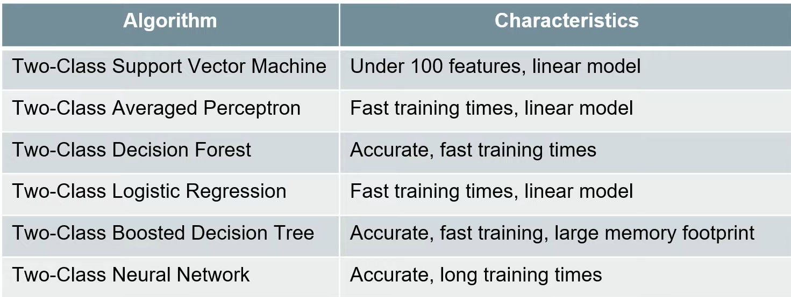
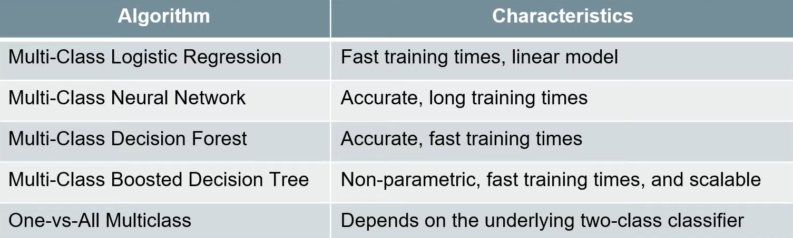
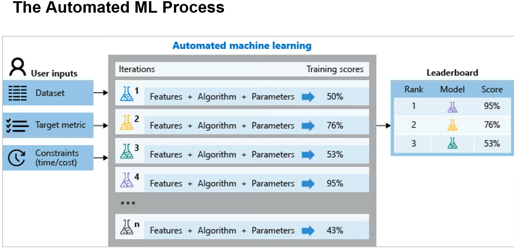

# Supervised and Unsupervised Learning

This lesson covered two of Machine Learning's fundamental approaches: **supervised** and **unsupervised** learning.

## Main topics:

**Supervised learning**

- More about classification and regression, two of the most representative supervised learning tasks
- Some of the major algorithms involved in supervised learning, as well as how to evaluate and compare their performance
- How to use the Designer in Azure Machine Learning Studio to build pipelines that train and compare the performance of both binary and multi-class classifiers.
- How to use automated machine learning to automate the training and selection of classifiers and regressors, and how to use the Designer in Azure Machine Learning Studio to create automated Machine Learning experiments

**Unsupervised learning**

- the main feature: clustering
- How unsupervised learning can address challenges like lack of labeled data, the curse of dimensionality, overfitting, feature engineering, and outliers
- An introduction to representation learning
- How to train a clustering model in Azure Machine Learning Studio

## Notes:

### Supervised Learning
 
#### Classification

----->  Algorithms used for ****Binary**** calssification:   <-----

----->  Algorithms used for ****Multi Class**** calssification:      <-----

#### Regression

Common machine learning algorithms for regression problems include:

- Linear Regression: 

-- Fast training, linear model. 

-- Relation between ****independent values**** and a ****numerical outcome****

-- To measure error: ordinary least sqaures (distance of the predicted value from the value line, minimizes the squared error); and gradiant descent (minimizes the gross error of each prediction)

- Decision Forest Regression: 

-- Accurate, fast training times

-- Combination between multiple decision trees

- Neural Net Regression: 

-- Accurate, long training times

-- Label culomn ****must be numeric**** 

Some of the most common types of classification problems include:

- tabular data: in the form of rows and columns.
- image or sound data: images or sounds whose categories are *already known*.
- text data: texts whose categories are already known.

Machine learning requires ****numerical data.**** This means that with images, sound, and text, several steps need to be performed during the preparation phase to transform the data into numerical vectors that can be accepted by the classification algorithms.

#### Automated Machine Learning (automated training)

Inputing the most frequent value is the default behavior in AutoML to deal with missing values for ****categorical**** features

### Unsupervised Learning
 
Algorithms learn from unlabeled data by looking for hidden structures in the data. Obtaining unlabeled data is comparatively inexpensive and unsupervised learning can be used to uncover very useful information in such data. For example, we can use ****clustering**** algorithms to discover implicit grouping within the data, or use ****association**** algorithms to discover hidden rules that are governing the data (e.g., people who buy product A also tend to buy product B).

#### Types of Unsupervised Learning

- Clustering
(groups elements with similar feataures together)
- Feataure (or Representantion) Learning
(creates new features, or groups in more representative)
- Abnomaly Detection
(unusual behaviour, fraude detectiong

#### Clustering

Is the problem of organizing entities from the input data into a finite number of subsets or clusters; the goal is to maximize both *intra-cluster similarity* and *inter-cluster differences.*

Four main algorithms:

- Centroid-based
(organize based on the controids of the clusters. e.g. K-means)

- Density-based
(organize based on who is closer together. Advantage: works better with arbitrary shape)

- Distribution-based
(the data has inherent distribution type - such as normal distribution)

- Hierarchical
(builds trees of clusters, for tasks such as taxonomies)

###### K-means

- Minimizes the intra-distance (sqaured error of the distance to the center)

- The assignemnt is based on the eucledian distance from the centroids

- Iterative method, calculated new centroid based on current cluster membership

- Requires normalized values

- Can be used to fill missing data

- The model isn't guaranteed to produce exactly this number of clusters. The algorithm starts with this number of data centroids and iterates to find the optimal configuration.

### Semi-Supervised Learnining
 
Sometimes fully labeled data cannot be obtained, or is too expensive—but at the same time, it may be possible to get partially labeled data. Semi-supervised learning combines the supervised and unsupervised approaches; typically it involves having small amounts of labeled data and large amounts of unlabeled data.

- Self training 
(using the labeled data do make predictions about the unlabeled. the result is a fully labeled data)

- Multi View training
(multiple models on different parts of the data)

- Self-ensemble learning
(simillar to multi view, but only one model and various hyperparameters)
