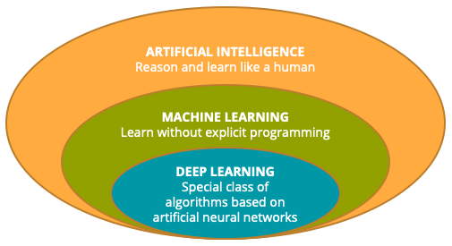

# Applications of Machine Learning

## Main topics:

The fundamentals of deep learning:

- The differences between classical machine learning and deep learning
- The benefits and applications of Deep Learning
- How to train your first neural network model

Specialized cases of model training:

- Similarity learning and the basic features of a recommendation engine
- Text classification and the fundamentals of processing text in machine learning
- Feature learning, an essential task in feature engineering
- Anomaly detection
- Time-series forecasting.

Practice with several hands-on labs, using the Designer in Azure Machine Learning Studio to train a neural network, a recommendation engine, a text classifier, and a time-series forecasting model.

## Notes:

****Machine learning:**** learning functions from data without explicit programming

"Deep" comes from the growth in numbers os hidden layers (opposing to the previous *shallow encoders*). Note that not all neural networks are deep learning algorithms (e.g. shallow encoders)

**Deep leraning:**

- It can be very computationally expensive, especially as model complexity increases

- It works well with massive amounts of training data

- It is capable of extracting features automatically

- Excells in raw and unestructured data

- Learn patterns without seeing or being told them

****Learning Rate**** is one of the core parameters for a NN. Controls the speed of weights update

#### Specialized cases of model training:

- ****Similarity learning (supervised - used for recomendations).****
Can be treated as a classification problem,  where it is not a continuous functions, but a descrete one (each attribute receives  0/1 value for correspondence with its pair), and the output is the sum of the values, thus indicating the level of similaruty; or as a regression problem (which outputs the degree of match e.g. between a consumer and an product).

One important varitation is the ****Ranked similarity learning**** , on which the supervised target is not a hard exact measure, but instead is an ordering measure. It is more used in real world applications for its scalability and real-time.

****Recomentadtion Systems**** can be divided in contend based (uses feataures of users and items) and collaborative filtering (only used identifiers, and get information from a matrix of ratings)
Number of factors: 200. This option specify the number of factors to use with the recommender. With the number of users and items increasing, it’s better to set a larger number of factors. But if the number is too large, performance might drop.

Number of recommendation algorithm iterations: 30. This number indicates how many times the algorithm should process the input data. The higher this number is, the more accurate the predictions are. However, a higher number means slower training. The default value is 30.

For Learning rate: 0.001. The learning rate defines the step size for learning.

- ****Text classification**** (supervised - gaining more and more applications nowadays)
The process of transforming the words in to numbers is called text embedding. There are 2 main forms: **word embedding** and **score**. *Score* is simpler, tries to calculate the value of each word in a sentence. It is very useful for sentiment analysis, bot is not able to be used for translation, for example. *Word embedding*, the words are transformed in a vectors with features. You can also *sentence embedding*, where you combine all word vectors in to a single sentence vector (most frequently used: Term Frequency-Inverse Document Frequency (TF-IDF) vectorization - https://en.wikipedia.org/wiki/Tf%E2%80%93idf) 

-REMEMBER TO USE THE SAME VOCABULARY FROM TRAINING WHEN APPLYING THE MODEL

**TF-IDF Weight:** This function calculates a term frequency/inverse document frequency score and assigns it to each n-gram. The value for each n-gram is its TF score multiplied by its IDF score.

The goal of using feature **hashing** is to reduce dimensionality; also it makes the lookup of feature weights faster at classification time because it uses hash value comparison instead of string comparison.

- ****Feature Learning and Anomaly Detection**** (supervise (classif.) or unsupervised (cluster))

Feature engineering is one of the core techniques that can be used to increase the chances of success in solving machine learning problems. As a part of feature engineering, *feature learning* (also called *representation learning*) is a technique that you can use to derive new features in your dataset.

**Supervised** is used when on-hot encoding is not an option because of the amount of labels, or with image classification (to reshape the image format)

**UnSupervised** is used when there are no labels (the best exemple is clustering: PCA, InepdendentCA, AutoEncoder and Matrix Factorization)

**Image Classification with CNNs:** the conv layers learn patterns on how the image is encoded, which is the same across all image (instead of dense NN, which only learn global patters. The representation of this new patters is called a *kernel*. The *max-pooling layer* down-samples the data and makes it translation invariant. Is the one who enables classification for isntance of a person face with multiple angled-photos.

**Image Search with AutoEncoding:** trained to reproduce as accuratle as possible the inputs. The values of the original data are the labels to trains the model (therefore it is unsupervised). The middle layer is the features vector (which is the compressed representation - reduced in dimension, not necessarely in size - of the input). Ergo, the left part is a deep learning algo wich vectorizes data.

They whay it works is, during training, you save the vectors representing the image you want (e.g. a house). Then, you feed the new images in the same network and calculate the distance of the vectors.

You can also you autoencoders do **anomaly detection.** You do this by following the MAE from the encoder's prediction, and stablishes a "normal" threshold.

- ****Forecasting**** (supervised)
Main types: ARIMA (auto regressive integrated moving avg); multi variate regression; prophet (by facebook, works best with seasonal effects); ForecastTCN (by microsoft, one-dimensional (time) CNN, has a longer "memory"); RNNs (aditional connections between the nodes, creating "memory". good for speacah recognition and translation)
