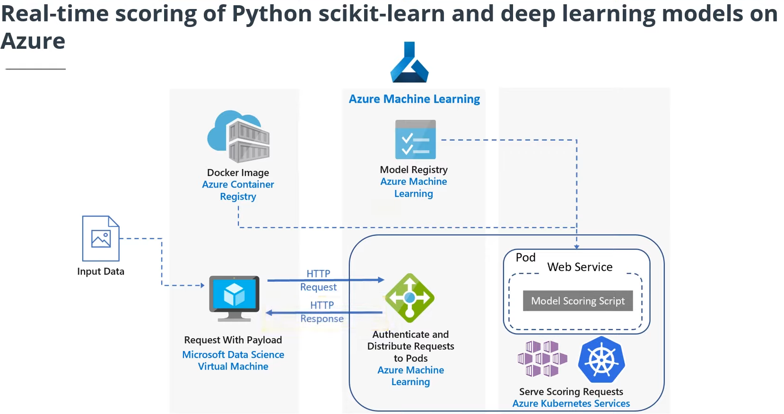

# Managed Services for Machine Learning

In this lesson I learned about managed services for Machine Learning and how these services are used to enhance Machine Learning processes.

## Main topics:

Various types of computing resources made available through managed services, including:

- Training compute
- Inferencing compute
- Notebook environments

The main concepts involved in the modeling process:

- Basic modeling
- How parts of the modeling process interact when used together
- More advanced aspects of the modeling process, like automation via pipelines and end-to-end integrated processes (also known as DevOps for Machine Learning or simply, MLOps)
- How to move the results of your modeling work to production environments and make them operational

Then, an introduction to the world of programming the managed services via the *Azure Machine Learning SDK for Python*.

## Notes:

### Compute Resources

A **compute target** is a designated compute resource or environment where you run training scripts or host your service deployment. There are two different variations on compute targets that we will discuss below: **training compute targets** and **inferencing compute targets.**

- Training Compute
Types that can be used: training clusters (can automatically scale, w/ CPU and GPU), instances, local PC etc

- Inferencing Compute
Once you have a trained model, you'll want to be able to deploy it for inferencing. It is also known as scoring. Real time (inferencing clustes: Azure Kabernet Service - AKS, Azure ML training cluster) X batch (virtually any compute)

### Compute instances

The **Attributes** describe the resource details of the compute instance, including the name, type, Azure subscription, the resource group, the Azure ML workspace that manages it, and the region. If you need to execute scripts that require details about your compute instance, this is where you can find it.

The **Resource properties** show the status and configuration of the compute instance, including links to its applications and public and private endpoints. You *cannot* enable SSH access after creating a compute instance, only at the time of creation. SSH access allows you to securely connect to the VM from a terminal or command window. Use the public IP address to connect via SSH or an integrated development environment (IDE) like Visual Studio Code.

Even if you delete an instance, all the notebook files remain sroted

### Basic Modeling

- Experiments:
Before you create a new run, you must first create an experiment. Remember, an experiment is a generic context for handling runs. Think about it as a logical entity you can use to organize your model training processes.

- Runs:
Once you have an experiment, you can create runs within that experiment. Model training runs are what you use to build the trained model. A run contains all artifacts associated with the training process, like output files, metrics, logs, and a snapshot of the directory that contains your scripts.

- Models:
A run is used to produce a model. A model is a piece of code that takes an input and produces output. To get a model, we start with a more general algorithm. By combining this algorithm with the training data —as well as by tuning the hyperparameters— we produce a more specific function that is optimized for the particular task we need to do. Put concisely:

   **Model** = algorithm + data + hyperparameters

- Model Registry:
The model registry, which keeps track of *all models* in an Azure Machine Learning workspace. Note that models are either produced by a Run or originate from outside of Azure Machine Learning (and are made available via model registration).

### Advanced Modeling

- Machine Learning Pipelines
As the process of building your models becomes more complex, it becomes more important to get a handle on the steps to prepare your data and train your models in an organized way. In these scenarios, there can be many steps involved in the end-to-end process, including: Data ingestion, Data preparation, Model building & training, Model deployment. These steps are organized into *machine learning pipelines.*

- MLOps: Creating Automatic End-to-End Integrated Processes
We don't want all the steps in the machine learning pipeline to be manual —rather, we want to develop processes that use automated builds and deployments. Some diferences include data version (not only code version), and model training

- Operationalizing Models
**Operationalization:** Deploying the ML model somewhere else after you have trained and evaluated it, and it is ready to use it outside your test environment.

- Real-time Inferencing
The model training process can be very compute-intensive. A trained model, on the other hand, is used to make decisions on new data quickly. Making these decisions on new data on-demand is called *real-time inferencing.*

-- Use AKS (high scale production deployment) when you need: fast response times, auto-scaling,GPU ou FPGA

-- Use Azure Container Instances when you need: quickly deploy and validate, testing a model under development

To create the environment, you can manually do it from Azure ML Studio interface or create programming the code (Azure ML Python SDK

- Batch Inferencing
Unlike real-time inferencing, batch inferencing is run on large quantities (*batches*) of existing data. Typically, batch inferencing is run on a *recurring schedule* against data stored in a database or other data store. Also, it is better when post-processing is needed, or inferencing is complex

- Combining with lambda architecture:
Exemple: fraud detections. You use batch to build the client's pattern of consumption; and real time to compare a new activity with the pattern 

- Programmatically Accessing Managed Services
Azure ML provides a code-first experience via the Azure Machine Learning SDK for Python. Using the SDK, you can start training your models on your local machine and then scale out to use Azure Machine Learning compute resources. Azure supports many of the popular open-source machine learning and deep learning Python packages, such as :Scikit-learn, Tensorflow, PyTorch, Keras.

Key areas include: manage datasets, organize and monitor experiments, model training, automated ML, model deployment. 

So far, the Managed Services for Azure Machine Learning lesson has covered compute instance and the benefits it provides through its fully managed environment containing everything you need to run Azure Machine Learning.

The compute instance provides a comprehensive set of a capabilities that you can use directly within a python notebook or python code including:

- Creating a Workspace that acts as the root object to organize all artifacts and resources used by Azure Machine Learning.
- Creating Experiments in your Workspace that capture versions of the trained model along with any desired model performance telemetry. Each time you train a model and evaluate its results, you can capture that run (model and telemetry) within an Experiment.
- Creating Compute resources that can be used to scale out model training, so that while your notebook may be running in a lightweight container in Azure Notebooks, your model training can actually occur on a powerful cluster that can provide large amounts of memory, CPU or GPU.
- Using Automated Machine Learning (AutoML) to automatically train multiple versions of a model using a mix of different ways to prepare the data and different algorithms and hyperparameters (algorithm settings) in search of the model that performs best according to a performance metric that you specify.
- Packaging a Docker Image that contains everything your trained model needs for scoring (prediction) in order to run as a web service.
- Deploying your Image to either Azure Kubernetes or Azure Container Instances, effectively hosting the Web Service.
